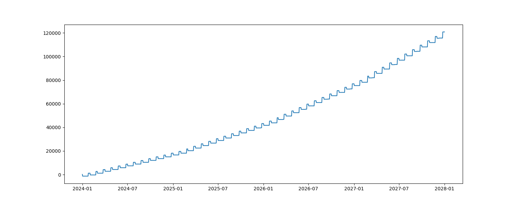

<div align="center">
  
</div>

## About

[](https://github.com/TimoKats/pylan/actions/workflows/unit_test.yml) 
[](https://github.com/TimoKats/pylan/releases/)
[](https://opensource.org/licenses/BSD-1-clause)
[](https://github.com/TimoKats/pylan)
[](https://github.com/TimoKats/pylan) 

Pylan is a library that calulates/analyzes the combined impact of recurring events. For example, it can be used to make financial projections, like investment gains, savings, and inflation.

## Getting started

To get started, you can install the Python library using PyPi with the following command:

```
pip install pylan-lib
```

This code snippet shows some functionalities available when doing simulations. For more information, please see the documentation on [pypi](https://pypi.org/project/pylan-lib/). **Also, I've added some useful examples of pylan in [this slidedeck](https://timokats.xyz/downloads/2025_pylan_presentation.pdf)**

```python
import matplotlib.pyplot as plt

from pylan import Item, Subtract, Add, Multiply

savings = Item(start_value=100)
salary_payments = Add("1m", 2500, offset="24d") # Salary paid every month at the 24th
salary_increase = Multiply("1y", 1.2) # Salary grows each year 20%
mortgage = Subtract("0 0 2 * *", 1500)  # cron support

salary_payments.add_projection(salary_increase) # Add increase to salary projection
savings.add_projections([salary_payments, mortgage])
result = savings.run("2024-1-1", "2028-1-1")

x, y = result.plot_axes()

plt.plot(x, y)
plt.show()
```

<div align="center">
  
</div>

