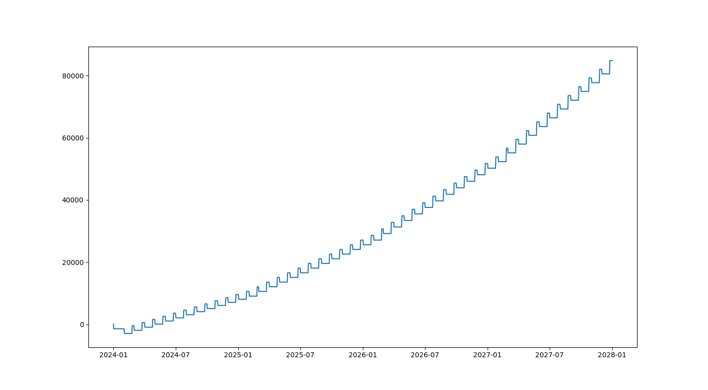

<div align="center">
  
</div>

## About

[](https://github.com/TimoKats/pylan/actions/workflows/test.yml) 
[](https://github.com/TimoKats/pylan/releases/)
[](https://opensource.org/licenses/ISC)
[](https://github.com/TimoKats/pylan)
[](https://github.com/TimoKats/pylan) 

Pylan is a Python library that simulates the impact of scheduled events over time. For example, it be used to simulate the impact of financial patterns, like investment gains, adding savings, and inflation.  

## Getting started

To get started, you can install the Python library using PyPi with the following command:

```
pip install pylan-lib
```

This code snippet shows some functionalities available when doing simulations. For more information, please see the documentation on [pypi](https://pypi.org/project/pylan-lib/).

```python
from pylan import Item, Operators, Pattern

savings = Item(start_value=100)

inflation = Pattern("6w", Operators.divide, 1.08)
salary_adds = Pattern("month", Operators.add, 2000, offset_start="15d")  # every month at the 15th
investment_gains = Pattern(["2024-4-1", "2024-7-1"], Operators.multiply, 1.1) # irregular patterns
mortgage = Pattern("0 0 2 * *", Operators.subtract, 1500)  # cron support

savings.add_patterns([salary_adds, inflation, investment_gains, mortgage])

result = savings.run("2024-1-1", "2025-1-1")
x, y = result.plot_axes()

plt.plot(x, y)
plt.show()
```

<div align="center">
  
</div>

## Roadmap
This version is very basic. I plan to add more things, so I'm looking for suggestions. This is a list of basic ideas that are currently on the roadmap.
- Multivariate operators. E.g. Adding salary that grows over time. Or bonds that pay off over time and at the end.
- Combining items and interact between them. For example, take money out of a savings item and put it in an investment item.
- More built-in timeframes, like quarterly, YTD, YOY, etc.
- ...
